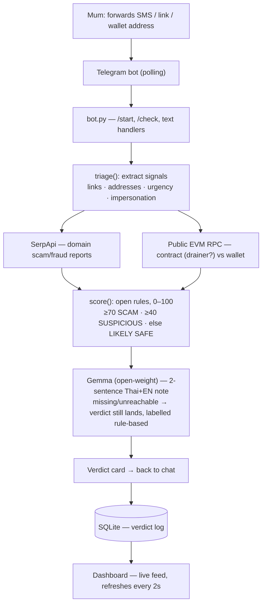

# 🛡️ ScamShield — built for my mum

*Hacktoberfest Weekend Challenge: Build for a Friend.*

| | |
| --- | --- |
| 🤖 Bot | https://t.me/scamsshield_bot |
| 📊 Dashboard | https://scamshield-g14e.onrender.com |
| 📝 Write-up | https://dev.to/memeshe/my-mum-keeps-getting-scam-texts-i-built-her-a-telegram-shield-1j1a |

## The problem

My mum gets parcel-scam SMSes in Thai almost weekly — "พัสดุถูกระงับ,
ยืนยันตัวตนด่วน" with a `bit.ly` link — plus fake bank warnings and crypto
"airdrop" forwards. She sends them to me, I say "don't click that," repeat
forever. She will never learn to read headers, check domains, or inspect a
contract. The people scammers target don't need education — they need an
answer, in their language, in the app they already use, in seconds.

## What it does

Forward **any suspicious SMS, link, or wallet address** to the Telegram bot
and get back a verdict card in seconds:

- **🚨 SCAM / ⚠️ SUSPICIOUS / ✅ LIKELY SAFE**, scored 0–100 by open rules
- **Reasons in Thai first, English second** — no jargon
- **Receipts, not vibes** — the shady link, what the web says about the
  domain, what the chain says about the address, printed on the card
- **What to do next** — "อย่าโอน อย่าให้ OTP", always ending with
  "ส่งมาให้ลูกดูก่อนเสมอ" (show your kid first)
- Also works with `/check <message>` for pasted text, and `/start` explains
  itself in Thai

A live dashboard streams every verdict (refreshes every 2s, costs zero API
credits to view), and `/health` exposes the service state for the host.

Example — the parcel scam above comes back **SCAM 75**: pressure tactics
(ด่วน, ระงับ, ยืนยันตัวตน) + impersonation (พัสดุ) + shortener link, with
live web hits on the domain and a two-sentence Gemma explanation. A plain
"แม่กินข้าวยัง" comes back **LIKELY SAFE 0**. Real cards are in the
[write-up](https://dev.to/memeshe/my-mum-keeps-getting-scam-texts-i-built-her-a-telegram-shield-1j1a).

## Tech stack

**Telegram — `python-telegram-bot` (long polling inside the FastAPI
lifespan).** No webhook server to expose, no tunnel tricks on fragile wifi.
Handlers carry explicit timeouts, an error handler, and a 120s triage budget
so one slow provider can never wedge the bot. `drop_pending_updates=True` on
start, so a redeploy never replays a backlog at mum.

**Triage pipeline — plain Python (`triage.py`, one file, every rule
readable).** Signals (links, `0x…` addresses, phone numbers, Thai + English
urgency/impersonation phrases) → SerpApi web grounding → public EVM RPC
probes (contract bytecode = drainer pattern, balance = active wallet) →
transparent point rules. When her kid asks "why 75?", the answer is three
named rules, not a shrug.

**Gemma — open-weight explanations behind a swappable plug.** The two
sentences mum reads are written by Gemma through any OpenAI-compatible
endpoint (`GEMMA_BASE_URL`: Google AI Studio today, Ollama or a 1-Click
model tomorrow, zero code change). The model explains; the rules decide. If
the endpoint is down or unconfigured, the verdict still lands and says it's
rule-based — the demo never fakes intelligence.

**SerpApi — live search grounding.** Only suspicious domains trigger a
search (free-tier friendly: ~250/month is plenty); hits mentioning
scam/fraud/phishing add points and get cited on the card.

**FastAPI + SQLite dashboard.** Verdicts persist locally and stream to `/`
with zero LLM/API cost per view. `/health` reports token presence, provider
flags, and poller errors so a dead bot is visible, not silent.

**Sentry.** Error + performance monitoring with full traces, so a crash in
the wild arrives as an issue, not a "mum says it's broken" mystery.

**Render.** Free-tier web service from `render.yaml`, auto-deploys on push,
health-checks on `/health`.

## How it works



## Why open-source AI is the core

- The explainer is an **open-weight model** behind a plain HTTP plug — swap
  providers or self-host without touching the code. Iteration that took an
  evening (one hosted Gemma too slow, another thinking out loud, fixed with
  a 15-line answer-extractor) is only possible when the model and the wire
  format are inspectable.
- The score is **readable rules in one file** — trust through showing work.
- It runs at **$0** — free hosting, free searches, public RPCs, open model.
  A family-safety tool shouldn't need a subscription or a data pipeline to
  survive.

## Configuration

| Variable | Required | What happens without it |
| --- | --- | --- |
| `TELEGRAM_BOT_TOKEN` | yes | polling stays off, `/health` shows `token_set: false` |
| `SERPAPI_KEY` | no | web grounding skipped |
| `SENTRY_DSN` | no | no error/performance reporting |
| `GEMMA_BASE_URL` | no | no LLM note — pure rule-based verdict, labelled honestly |
| `GEMMA_API_KEY` | no | sent as `Bearer` when the endpoint needs auth |
| `GEMMA_MODEL` | no | defaults to `gemma-4-26b-a4b-it` |

On Render, set secrets in the dashboard (or API) — `render.yaml` only holds
public defaults. Note: Render's env-var PUT replaces the *whole* set, so
always send every key at once.

## Run locally

```bash
python3 -m venv .venv && . .venv/bin/activate
pip install -r requirements.txt
cp .env.example .env  # fill TELEGRAM_BOT_TOKEN (BotFather)
python app.py
```

## Deploy (Render)

[](https://render.com/deploy?repo=https://github.com/memeshee/scamshield)

Free credits: claim at hacktoberfest.com/my. `render.yaml` sets the web
service; add `TELEGRAM_BOT_TOKEN` (+ optional `SERPAPI_KEY`, `SENTRY_DSN`,
`GEMMA_BASE_URL`, `GEMMA_API_KEY`, `GEMMA_MODEL`) in the Render dashboard.

## Categories entered

Render (hosting) · Gemma (open-weight explanations) · SerpApi (live search
grounding) · Sentry (error + performance monitoring)

## Demo script (judges, 60s)

1. `/start` → intro in Thai
2. Forward Thai parcel-scam SMS with `bit.ly` link → 🚨 SCAM + receipts
3. Send `0x...` drainer address → contract hit via public RPC
4. Send benign family message → ✅ LIKELY SAFE
5. Open `/` dashboard → verdict feed updates live
