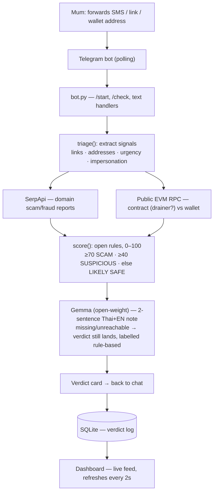

# 🛡️ ScamShield — built for my mum (Hacktoberfest Weekend Challenge)

Forward any suspicious SMS / link / wallet address to the Telegram bot, get a
verdict in seconds: **SCAM / SUSPICIOUS / LIKELY SAFE** with reasons in Thai +
English, grounded receipts, and what to do next.

## Why open-source AI is the core

- Every verdict carries an explanation written by an **open-weight model
  (Gemma)** served through an OpenAI-compatible endpoint (`GEMMA_BASE_URL`,
  any provider — Google AI Studio, Ollama locally, a 1-Click model).
  Swap models, self-host, inspect every rule — impossible with a closed API.
- **Local-first fallback:** the rule engine (pressure tactics, shorteners,
  impersonation, on-chain probes) scores without any network and the verdict
  is labelled honestly, so the demo never fakes intelligence.
- No family chat needs to live on a closed server to stay safe.

## Live

- Bot: `https://t.me/scamsshield_bot`
- Dashboard: `https://scamshield-g14e.onrender.com` (health + verdict feed, 0 credits burned)

## How it works



The model explains; the rules decide; the receipts (web hits, RPC results)
are printed on the card. No key configured for an optional provider? That
stage is skipped and the card says so — never a mocked verdict.

## Configuration

| Variable | Required | What happens without it |
| --- | --- | --- |
| `TELEGRAM_BOT_TOKEN` | yes | polling stays off, `/health` shows `token_set: false` |
| `SERPAPI_KEY` | no | web grounding skipped (`serp.skipped: true` on the card path) |
| `SENTRY_DSN` | no | no error/performance reporting |
| `GEMMA_BASE_URL` | no | no LLM note — pure rule-based verdict, labelled honestly |
| `GEMMA_API_KEY` | no | sent as `Bearer` when the endpoint needs auth |
| `GEMMA_MODEL` | no | defaults to `gemma-4-26b-a4b-it` |

On Render, set secrets in the dashboard (or API) — `render.yaml` only holds
public defaults. Note: Render's env-var PUT replaces the *whole* set, so
always send every key at once.

## Run locally

```bash
python3 -m venv .venv && . .venv/bin/activate
pip install -r requirements.txt
cp .env.example .env  # fill TELEGRAM_BOT_TOKEN (BotFather)
python app.py
```

## Deploy (Render)

[](https://render.com/deploy?repo=https://github.com/memeshee/scamshield)

Free credits: claim at hacktoberfest.com/my. `render.yaml` sets the web
service; add `TELEGRAM_BOT_TOKEN` (+ optional `SERPAPI_KEY`, `SENTRY_DSN`,
`GEMMA_BASE_URL`) in the Render dashboard.

## Categories entered

Render (hosting) · Gemma (open-weight explanations) · SerpApi (live search
grounding) · Sentry (error + performance monitoring)

## Demo script (judges, 60s)

1. `/start` → intro in Thai
2. Forward Thai parcel-scam SMS with `bit.ly` link → 🚨 SCAM + receipts
3. Send `0x...` drainer address → contract hit via public RPC
4. Send benign family message → ✅ LIKELY SAFE
5. Open `/` dashboard → verdict feed updates live
